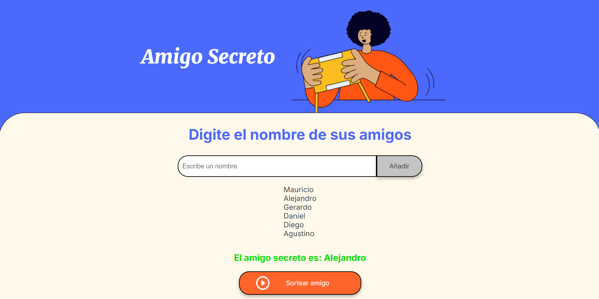

# 🎁 Amigo Secreto  

Una aplicación interactiva para realizar sorteos de **Amigo Secreto** de manera sencilla y rápida. Los usuarios pueden ingresar nombres en una lista y realizar un sorteo aleatorio para determinar quién será el **amigo secreto** de cada participante.  

## 🚀 Características  

✅ **Agregar nombres:** Los usuarios pueden escribir el nombre de un amigo en un campo de texto y agregarlo a una lista visible con un clic en **"Adicionar"**.  
✅ **Validación de entrada:** El sistema evita nombres vacíos o que contengan números, asegurando una lista válida.  
✅ **Visualización en tiempo real:** Los nombres ingresados se muestran inmediatamente en una lista.  
✅ **Sorteo aleatorio:** Con un solo clic en **"Sortear Amigo"**, la aplicación elige un nombre al azar y lo muestra en pantalla.  

## 📷 Captura de pantalla 



## 🔧 Tecnologías utilizadas  

- **HTML** – Estructura del proyecto  
- **CSS** – Diseño y estilos  
- **JavaScript** – Funcionalidad e interactividad  

## 📌 Cómo usar  

1. Ingresa el nombre de los participantes en el campo de texto.  
2. Presiona **"Adicionar"** para agregarlos a la lista.  
3. Cuando todos los nombres estén en la lista, haz clic en **"Sortear Amigo"**.  
4. ¡El nombre seleccionado se mostrará en pantalla!  

## 📂 Instalación y ejecución 

Si deseas ejecutar este proyecto localmente:  

1. Clona este repositorio:  
   ```bash
   git clone https://github.com/tu-usuario/amigo-secreto.git
   ```  
2. Abre el archivo `index.html` en tu navegador.